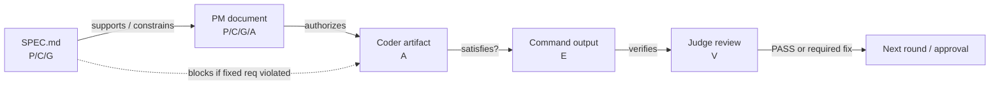

# SDLC prompt logic and skill graph

Date: 2026-07-05

## Purpose

This document defines the prompt design for the local SDLC runner as a small
formal system. The goal is to make local LLM calls easier to control by forcing
each role and skill to exchange short propositions, typed graph edges, and
observable evidence instead of implicit assumptions.

## Whole-system model

Each API call is modeled as:

```text
O = F(role, skill, function, D, I, profile)
```

Where:

- `role`: supervisor, pm, coder, or judge.
- `skill`: the system prompt body used for this independent API call.
- `function`: cognitive operation such as `plan_work`, `generate_artifact`,
  `semantic_repair`, or `judge_review`.
- `D`: visible document set: SPEC.md, prior agent documents, file context,
  runtime facts, command output, and manifests.
- `I`: current instruction.
- `profile`: effective API settings.
- `O`: output document or artifact.

Hidden memory is not a member of `D`, so it cannot support a claim.

## Proposition notation

```text
Pn = premise supplied by D
Cn = constraint that must not be violated
Gn = goal or desired behavior
En = observable evidence
An = action or artifact
Vn = verdict supported by evidence
```

An action or verdict is valid only when it has a visible derivation:

```text
P* and C* and G* and E* |- A or V
```

If the derivation is incomplete, the correct output is `UNKNOWN` or
`MISSING_CONTEXT`, not a guessed implementation.

## Handoff graph

Each call also has a typed graph:

```text
G = (V, E)
```

`V` contains propositions and document nodes. `E` contains typed edges:

- `supports(X, Y)`: X is evidence or a premise for Y.
- `constrains(C, A)`: C limits action A.
- `satisfies(A, G)`: A is intended to satisfy G.
- `verifies(E, V)`: E justifies verdict V.
- `blocks(C, A)`: C forbids A.



## Role invariants

| Role | Mathematical form | Invalid when |
|---|---|---|
| supervisor | `route_task(P, C, risk) -> ordered calls` | a required gate has no visible reason edge |
| pm | `plan_work(P, C, G) -> acceptance criteria + authorized A` | goals are not testable or constraints are missing |
| coder | `generate_or_repair_artifact(P, C, G, E) -> minimal A` | it edits tests to hide product failure, rewrites unrelated files, or lacks a support edge |
| judge | `judge_review(P, C, A, E) -> V` | PASS lacks command/file evidence or ignores a blocking constraint |

## Skill-level proposition responsibilities

| Skill | Primary propositions | Required graph edges | Output focus |
|---|---|---|---|
| `sdlc` | P: request facts, C: fixed requirements, G: target process, A: phase plan | `supports(P,G)`, `constrains(C,A)` | PM control / orchestration document |
| `spec` | P: user intent, C: non-negotiables, G: accepted behavior | `supports(P,G)`, `constrains(C,G)` | SPEC.md sections and acceptance criteria |
| `architect` | P: existing structure, C: fixed reqs, A: architecture decisions | `constrains(C,A)`, `satisfies(A,G)` | component graph, dependency direction, ADRs |
| `ddd` | P: domain language, C: domain invariants, A: model boundaries | `supports(P,A)`, `constrains(C,A)` | ubiquitous language, context map, aggregates |
| `tdd` | G: acceptance behavior, E: failing/passing tests, A: minimal implementation | `verifies(E,V)`, `satisfies(A,G)` | tests, minimal code artifacts, repair rationale |
| `ui` | P: user task, C: accessibility/design constraints, A: interface states | `satisfies(A,G)`, `blocks(C,A)` | UI component plan and implementation |
| `review` | P: claimed change, C: requirements, E: command/file evidence, V: verdict | `verifies(E,V)`, `blocks(C,A)` | objective findings and required fixes |
| `security` | C: security invariants, E: threat evidence, V: risk verdict | `blocks(C,A)`, `verifies(E,V)` | risks, mitigations, must-fix issues |
| `deploy` | C: release constraints, E: build/health evidence, A: release action | `constrains(C,A)`, `verifies(E,V)` | deployment plan, rollback, health checks |
| `observe` | E: logs/metrics/traces, G: observability goals, A: instrumentation | `supports(E,V)`, `satisfies(A,G)` | observability design |
| `sre` | C: SLO/error budget, E: reliability evidence, V: reliability verdict | `constrains(C,A)`, `verifies(E,V)` | SLO/SLI, failure modes, incident response |
| `refactor` | P: current code facts, C: behavior preservation, A: structure change | `constrains(C,A)`, `verifies(E,V)` | behavior-preserving refactor plan/artifact |

## Prompt design rule

Planning and review outputs should include:

```text
## Proposition Ledger
- P1: ...
- C1: ...
- G1: ...
- E1: ...
- A1: ...
- V1: ...

## Graph Edges
- supports(P1, G1)
- constrains(C1, A1)
- satisfies(A1, G1)
- verifies(E1, V1)
```

Artifact-only coder outputs do not print this reasoning, but the system prompt
requires the coder to perform the same reduction internally before emitting a
patch, file artifact, or `MISSING_CONTEXT`.

## Semantic repair rule

When executable evidence produces semantic contracts, the next repair call uses
the `semantic_repair` function profile. Its accepted artifact set is narrowed:

```text
|A| = 1
type(A) in {BEGIN_SEARCH_REPLACE, unified_diff}
touched_files(A) = one product-code file
tests/ notin touched_files(A)
```

This turns a known failed proposition into a small proof obligation rather than
another broad generation attempt.

