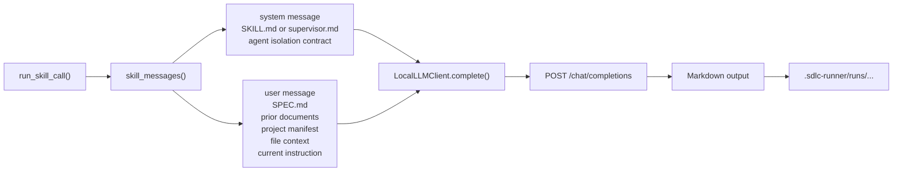
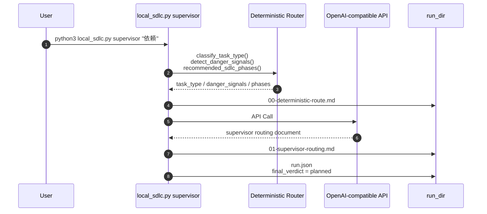
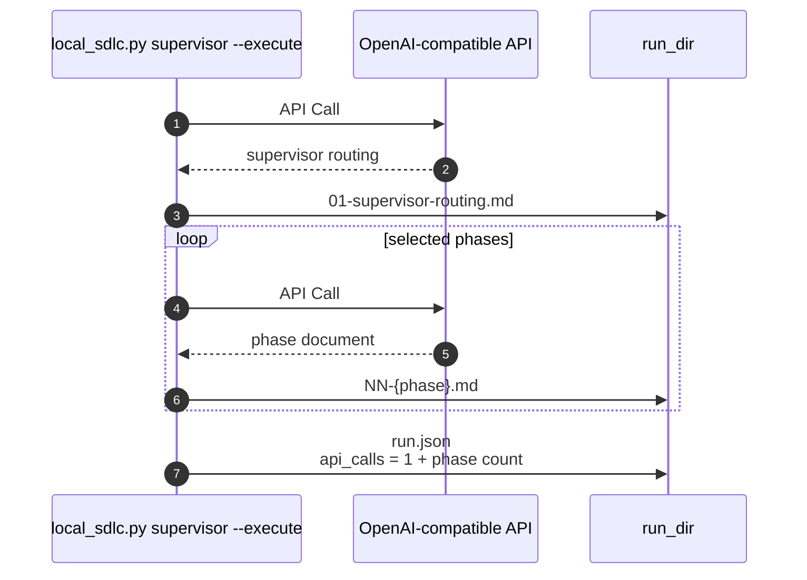
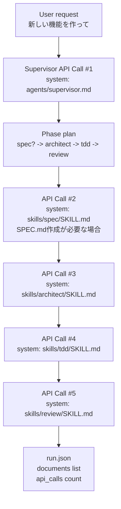
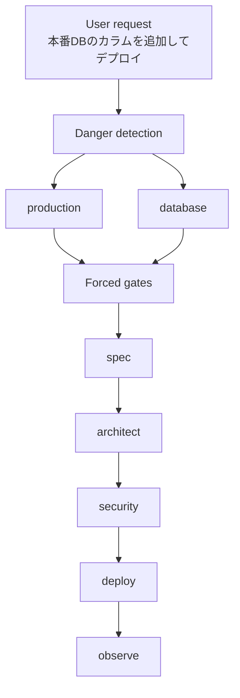
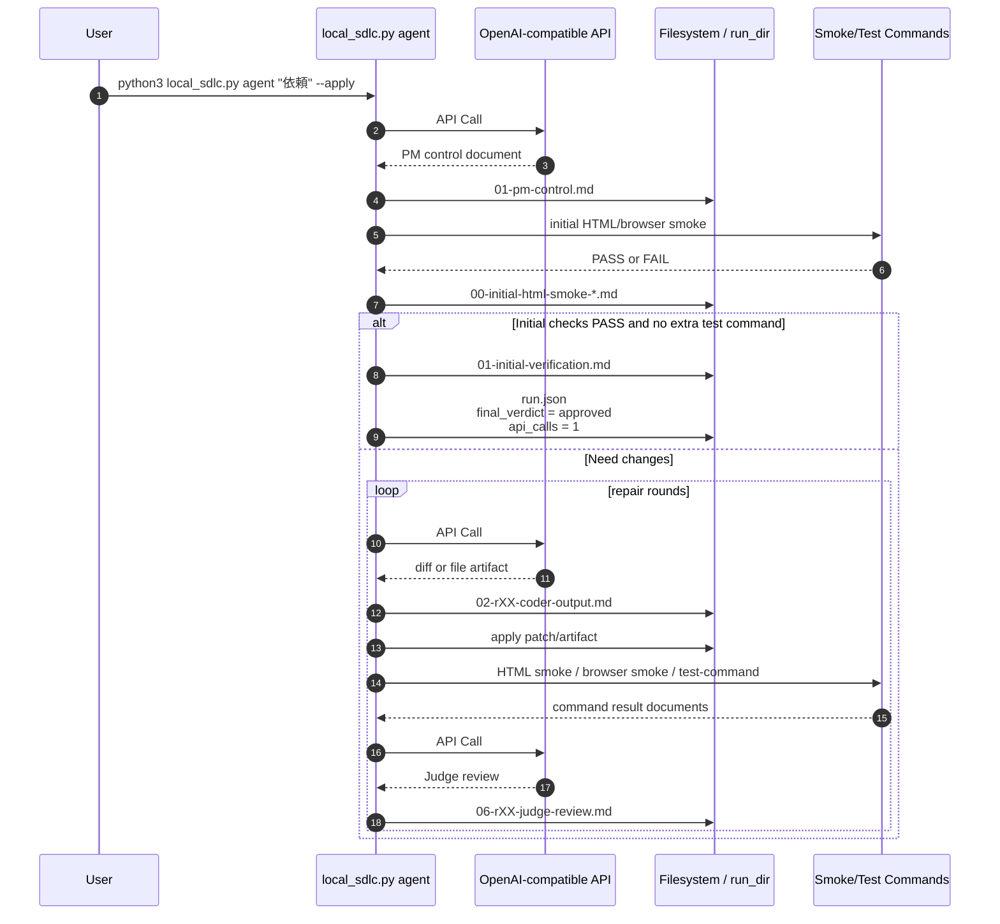
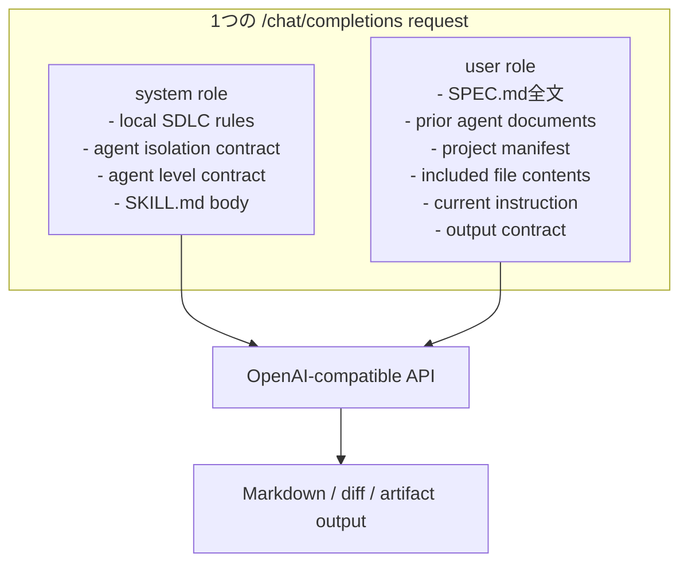
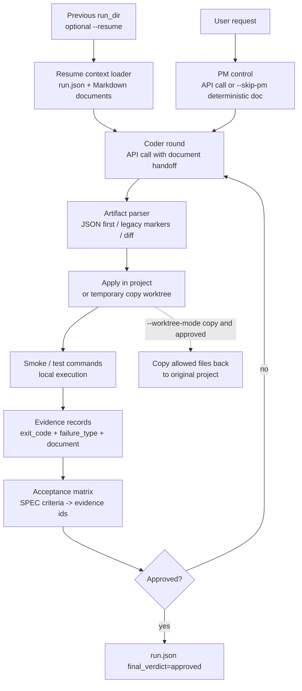
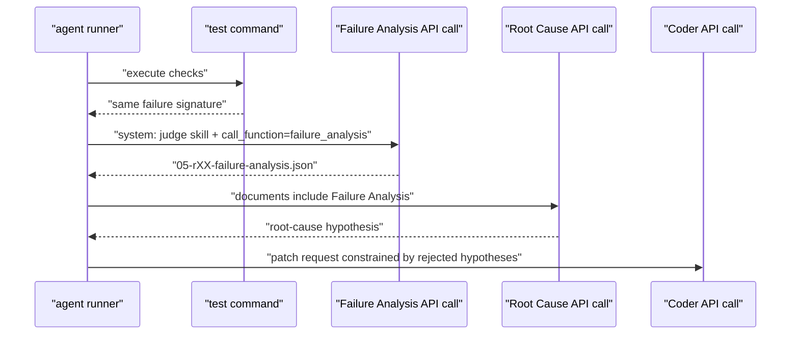
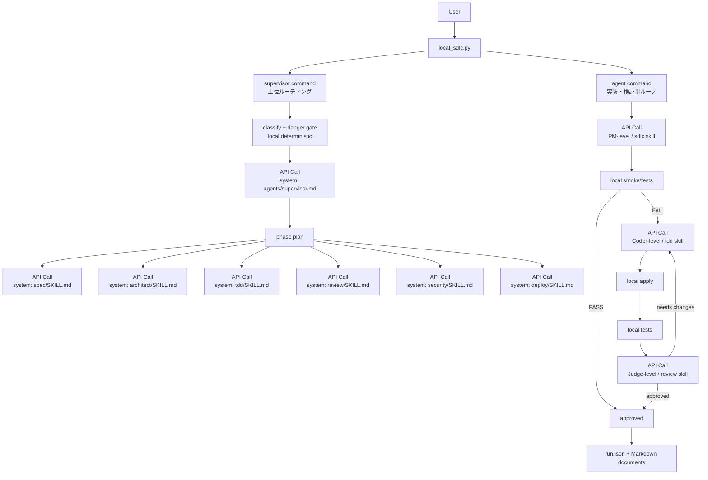

# local_sdlc.py Agent Flow 図解

このドキュメントは、`local_sdlc.py` の中で各エージェントがどの順番で動き、どのタイミングで別々の OpenAI 互換 API 呼び出しとして実行されるかを図解する。

## まず押さえること

`local_sdlc.py` には、大きく 3 つの実行系がある。

| コマンド | 役割 | 主な用途 |
|---|---|---|
| `supervisor` | 元リポジトリの Supervisor / SDLC に近い上位ルーター | 依頼を分類し、`spec`, `architect`, `tdd`, `review`, `security`, `deploy` などを選ぶ |
| `agent` | 実装・適用・テスト・Judge の閉ループ | 実ファイルを作る、修正する、検証して直す |
| `supervise` | 初期実装の PM / Coder / Judge 固定フロー | レガシー互換・単純な文書交換確認 |

重要なのは、`run_skill_call()` が呼ばれるたびに `LocalLLMClient.complete()` が呼ばれ、`POST /chat/completions` が 1 回発生すること。

つまり、下の図で `API Call #N` と書いてある箱は、別々の `/chat/completions` request であり、別の system prompt を持つ。

## API 呼び出しの基本構造



### ここでの分離

- system prompt は各スキルごとに違う
- user prompt には SPEC.md と文書成果物だけが渡る
- 前の API call の会話履歴は渡らない
- 後続エージェントは、保存済み Markdown を「文書」として読む

## 1. `supervisor` コマンドの流れ

`supervisor` は、元リポジトリの `sdlc-skills/agents/supervisor.md` に近い役割を持つ。

まずローカルの決定ロジックで依頼を分類し、危険信号を検出する。その後、`supervisor.md` を system prompt として 1 回 API 呼び出しを行い、ルーティング文書を作る。

`--execute` がない場合は、ここで止まる。



### 例

```bash
python3 local_sdlc.py supervisor "新しい検索機能を実装して"
```

実 API 確認では以下のようになった。

```json
{
  "command": "supervisor",
  "task_type": "new_feature",
  "danger_signals": [],
  "recommended_phases": ["architect", "tdd", "review"],
  "execute": false,
  "final_verdict": "planned",
  "api_calls": 1
}
```

## 2. `supervisor --execute` の流れ

`--execute` を付けると、Supervisor が選んだ各フェーズを順番に実行する。

各フェーズは別 API call であり、そのフェーズの `SKILL.md` が system prompt に入る。



### 新機能タスクの典型例



### 危険信号がある場合



この場合、`security` や `deploy` を飛ばさないことが重要なゲートになる。

## 3. `agent` コマンドの流れ

`agent` は、実装・適用・検証・Judge の閉ループを担当する。

これは `supervisor` の下位に置くべき実装エンジンであり、固定 PM / Coder / Judge ループに近い。



### Tetris 確認時の実例

`tetris.html` が既に検証に通っていたため、PM の 1 API call だけで停止した。

```json
{
  "command": "agent",
  "completed_rounds": 0,
  "final_verdict": "approved",
  "api_calls": 1,
  "documents": [
    "01-pm-control.md",
    "00-initial-html-smoke-01.md",
    "00-initial-html-smoke-02.md",
    "01-initial-verification.md"
  ]
}
```

これは「Coder を呼び忘れた」のではなく、「検証済み成果物を無駄に再編集しない」ための停止である。

## 4. API Call と非 API 処理の区別

| 処理 | API call か | 説明 |
|---|---:|---|
| `health_check()` / `/v1/models` | HTTP call だが skill call ではない | API 生存確認。エージェント推論ではない |
| `run_skill_call(supervisor.md)` | はい | Supervisor routing。別 system prompt |
| `run_skill_call(spec SKILL.md)` | はい | `/spec` フェーズ。別 system prompt |
| `run_skill_call(architect SKILL.md)` | はい | `/architect` フェーズ。別 system prompt |
| `run_skill_call(tdd SKILL.md)` | はい | `/tdd` または Coder-level。別 system prompt |
| `run_skill_call(review SKILL.md)` | はい | `/review` または Judge-level。別 system prompt |
| `extract_unified_diff()` | いいえ | ローカル処理 |
| `apply_patch_file()` / `apply_file_artifact()` | いいえ | ローカルファイル操作 |
| `run_html_smoke_checks()` | いいえ | ローカル検証。必要なら Node / Chromium を起動 |
| `run_checked_command()` | いいえ | ローカルテスト実行 |
| `write_run_document()` | いいえ | run_dir への保存 |

## 5. system prompt と user prompt の分離



各 API call はこの構造を持つ。たとえば `architect` と `tdd` は、同じ `SPEC.md` を user prompt で受け取るが、system prompt は別々の `SKILL.md` になる。

## 6. run_dir の読み方

実行ごとに `.sdlc-runner/runs/<timestamp-or-name>/` が作られる。

| ファイル | 意味 |
|---|---|
| `00-deterministic-route.md` | ローカル分類ロジックによる推奨ルート |
| `01-supervisor-routing.md` | `agents/supervisor.md` による Supervisor API call の結果 |
| `NN-{phase}.md` | 各フェーズの API call 結果 |
| `01-pm-control.md` | `agent` の PM call 結果 |
| `02-rXX-coder-output.md` | `agent` の Coder call 結果 |
| `05-rXX-html-smoke-*.md` | ローカル検証結果 |
| `06-rXX-judge-review.md` | `agent` の Judge call 結果 |
| `run.json` | 実行全体の manifest。`api_calls`, `documents`, `final_verdict`, `evidence`, `acceptance_matrix`, `failure_summary` を確認できる |

## 7. 追加された汎用 agent 機能

今回の改善では、Tetris や Redis だけに効く特殊処理ではなく、同種の開発タスクで再利用できる基盤機能を追加した。



### 7.1 Acceptance Matrix

`SPEC.md` の受け入れ条件らしきチェック項目を抽出し、実行証跡と対応づける。

`run.json` には以下が入る。

```json
{
  "acceptance_criteria": [{"id": "A01", "text": "..."}],
  "evidence": [{"id": "E01", "status": "pass", "failure_type": null}],
  "acceptance_matrix": [{"id": "A01", "status": "pass", "evidence_ids": ["E01"]}]
}
```

これにより、Judge や人間レビューは「どの証跡で承認されたか」を run_dir だけで追える。

### 7.2 Run Resume

`agent --resume <run_dir>` は、前回の `run.json` と Markdown 文書を読み、次の repair round から続ける。

```bash
python3 local_sdlc.py agent "失敗を修正して" \
  --resume .sdlc-runner/runs/20260704-120000 \
  --include app.py \
  --apply \
  --test-command "python3 -m py_compile app.py"
```

このとき、新しい Coder API call は前回の会話履歴ではなく、保存済み文書だけを入力として受け取る。

### 7.3 JSON Artifact

Coder は従来の diff / `BEGIN_FILE` に加えて、JSON artifact を返せる。

```json
{
  "artifacts": [
    {
      "type": "replace_file",
      "path": "app.py",
      "content": "print('fixed')\n"
    }
  ]
}
```

`--artifact-format json` では JSON 契約違反を明確な失敗として扱う。`auto` では JSON を先に試し、失敗した場合だけ従来形式へフォールバックする。

### 7.4 Failure Classifier

command result は `failure_type` に分類される。

| 種別 | 主な根拠 |
|---|---|
| `syntax_error` | `SyntaxError`, `IndentationError` |
| `timeout` | exit code 124, timeout 文言 |
| `blocked_command` | safety policy による BLOCKED |
| `missing_executable` | command not found など |
| `test_assertion_failed` | AssertionError / unittest failures |
| `test_error` | traceback / unittest errors |
| `service_unavailable` | connection refused / address already in use |

失敗分類は `run.json.failure_summary` にも集約されるため、次ラウンドの Coder は「何が壊れたか」を短く受け取れる。

### 7.5 Failure Analysis Agent

同じ実行失敗シグネチャが繰り返された場合、`agent` は通常の Coder 修復へ進む前に、Judge レベルの `failure_analysis` を独立 API call として実行する。



Failure Analysis の出力は JSON として扱う。

- `observed_facts`: 実行証跡から言える事実
- `attempted_actions`: すでに試した修正
- `rejected_hypotheses`: 同じ失敗が残ったため棄却する仮説
- `active_constraints`: 次ラウンドが守るべき制約
- `next_required_action`: 次にどのロールが何をすべきか
- `formal_constraints`: `same(F_i,F_t) and applied(A_i) => reject(H_i)` のような命題化された制御条件

このエージェントはパッチを生成しない。目的は、失敗履歴を機械的に構造化し、Root Cause / Coder が同じ仮説を繰り返さないようにすることである。

### 7.6 Temporary Worktree Mode

`--worktree-mode copy` は一時コピー上で patch / artifact を適用し、test command を実行する。

```bash
python3 local_sdlc.py agent "app.pyを修正" \
  --include app.py \
  --apply \
  --worktree-mode copy \
  --judge-mode command-only \
  --test-command "python3 -m py_compile app.py"
```

`final_verdict: approved` になった場合だけ、`--include` / `--new-file` で許可されたファイルを元プロジェクトへコピーし戻す。失敗時は元プロジェクトを変更しない。

## 7. 全体像



## 8. 現在の到達点と注意点

到達済み:

- `supervisor` は元の `agents/supervisor.md` を system prompt として呼べる
- `supervisor --execute` はフェーズごとに別 API call / 別 SKILL.md system prompt で呼べる
- `agent` は実装・適用・検証・Judge の閉ループを持つ
- run_dir に API call 数と各文書が残る

今後の統合課題:

- `supervisor --execute` の `tdd` フェーズを、必要に応じて `agent` の patch/apply/test loop に自動接続する
- SPEC.md の受け入れ条件ごとの確認結果を、より機械的な acceptance matrix として保存する
- 途中再開、secret redaction、関連ファイル自動探索を追加する
