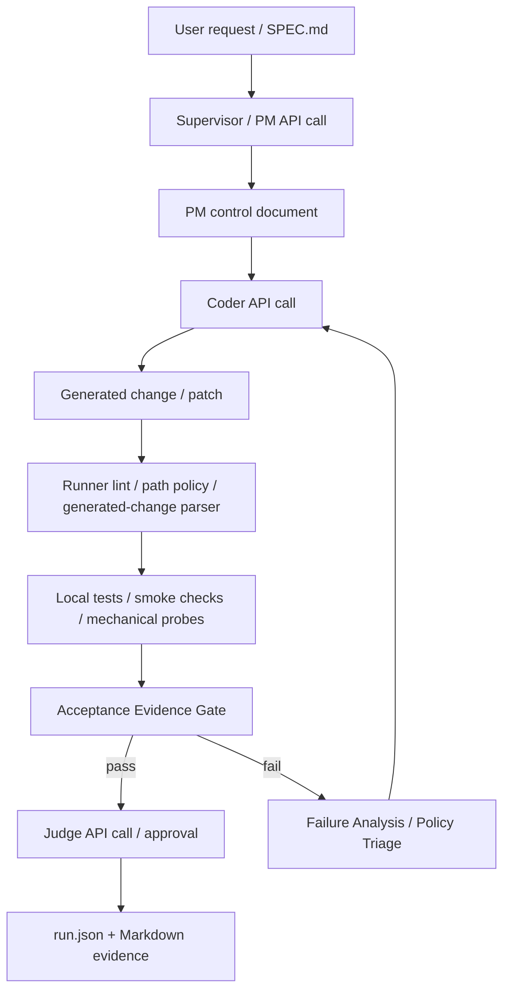

# Local SDLC Agent: 文書媒介型マルチロールLLM開発制御システムの技術的特徴と発明候補

## 要旨

本稿は、`Local SDLC Agent` として実装されたローカルLLM向け開発エージェント基盤の技術的特徴を整理し、特許出願時に発明開示として検討し得る構成要素を抽出する。

本システムは、ローカルLLMを用いて仕様作成、実装、検証、失敗分析を制御する単独CLI型のコーディングエージェントである。特徴は、単にローカルLLMへコード生成を依頼する点ではなく、複数の独立したLLM API call、文書成果物、実行証拠、生成物の機械検査、失敗分析、プロジェクト方針分類、受け入れ条件照合を統合し、LLMの推論とローカルrunnerの決定的検査を組み合わせて開発を進める点にある。

特許候補として厚く検討すべき中核は、以下の複合制御である。

1. system prompt 単位で隔離された複数ロールLLM呼び出しを、会話履歴ではなく保存文書で接続する制御方式
2. 仕様命題・実行証拠・生成物の適用可否を結ぶ evidence graph / acceptance matrix
3. LLMに直接適用権限を渡さず、分類だけを委譲し、適用はrunnerが機械検査する project policy triage
4. protocol failure と functional failure を分離した修復予算制御
5. repeated failure family と棄却仮説を用いた root-cause repair loop
6. Mechanical Probe の観測命題をLLM推論より優先する実行事実優先制御
7. role ではなく call function を主キーにした API profile 合成と監査可能な run manifest

なお、本稿は法的な特許性判断ではない。USPTO の説明では、特許には実用性、明細化、新規性、非自明性などが論点となる[^uspto-essentials]。本稿は、そのうち「どの技術構成を請求項候補として抽出すべきか」を技術面から整理するものであり、先行技術調査と請求項作成は弁理士・特許弁護士による別工程を要する。

[^uspto-essentials]: USPTO, "Patent essentials", https://www.uspto.gov/patents/basics/essentials

---

## 1. はじめに

大規模言語モデル（LLM）は、自然言語指示からソースコードを生成できる。しかし、一般的な対話型コード生成では、以下の問題が生じる。

- LLM が仕様を暗黙補完する
- 生成コードの自己評価が甘くなる
- テスト未実行でも「動く」と主張する
- 修正ループで同じ仮説を繰り返す
- テスト自体が誤っている場合に、製品コードとテストのどちらを直すべきか判断できない
- 出力形式が壊れ、変更パッチや生成ファイルとして安全に適用できない
- モデルごとの温度、token budget、thinking 設定が散在し、実験再現性が落ちる

`Local SDLC Agent` は、この問題に対し、LLMを「コードを書く単体エージェント」としてではなく、文書・証拠・制約・ロール分離を持つ開発プロセス内の部品として扱う。

### 用語: 生成物

本稿でいう「生成物」とは、LLM が runner へ渡す適用候補を指す。具体例は、unified diff、`BEGIN_FILE`、`BEGIN_SEARCH_REPLACE`、JSON の `replace_file` / `search_replace` などである。実装上の識別子として `artifact` という名前が残る箇所はあるが、本文では原則として「生成物」「変更パッチ」「生成ファイル」と表記する。

---

## 2. システム概要

### 2.1 実装単位

本システムは、利用者から見ると以下の単独CLIで起動される。

```bash
python3 local_sdlc.py ...
```

内部実装は `local_sdlc/` パッケージへ分割されている。

| 実装領域 | 主なファイル | 役割 |
|---|---|---|
| CLI / Presentation | `local_sdlc.py`, `local_sdlc/cli.py` | コマンド入口、設定表示、doctor/health |
| LLM接続 | `local_sdlc/llm_client.py`, `local_sdlc/models.py` | OpenAI互換API、model profile、function profile |
| skill呼び出し | `local_sdlc/skills.py` | SKILL.md を system prompt として渡す |
| agent loop | `local_sdlc/agent_runner.py` | PM/Coder/Judge/Failure Analysis/Triage の制御 |
| stage execution | `local_sdlc/stage_runner.py`, `local_sdlc/stages.py` | 仕様書から小ステージへ分解し順次実行 |
| 生成物制御 | `local_sdlc/artifacts.py` | 生成物抽出、lint、正規化、stream guard、mechanical probe |
| verification | `local_sdlc/verification.py` | smoke test / command evidence |
| run state | `local_sdlc/run_state.py` | `.sdlc-runner/runs/` への文書保存 |

### 2.2 基本フロー



重要なのは、各 LLM 呼び出しが同じ会話履歴を共有しない点である。前段の結果は `.sdlc-runner/runs/` に保存された Markdown / JSON 文書として後段へ渡る。

---

## 3. 技術的特徴

### 3.1 system prompt 単位のロール隔離

各skill/agent callでは、役割定義を user prompt ではなく system prompt に置く。

```text
system:
  - agent isolation contract
  - role contract
  - SKILL.md body

user:
  - SPEC.md
  - prior documents
  - file context
  - command evidence
  - current instruction
```

これにより、PM、Coder、Judge、Failure Analysis、Project Policy Triage は、それぞれ別のAPI callとして動作する。

技術的効果:

- Coder の自己正当化が Judge に伝染しにくい
- 後段ロールは保存文書のみを根拠に判断する
- ロールごとの system prompt と API 設定を監査できる
- `run.json` に API call function と model profile を残せる

実装根拠:

- `local_sdlc/skills.py`
- `local_sdlc/agent_runner.py`
- `local_sdlc/supervisor_runner.py`

### 3.2 文書媒介型エージェント通信

本システムでは、エージェント間通信を暗黙の会話履歴ではなく、保存済み文書へ外在化する。

保存される文書例:

- `01-pm-control.md`
- `02-rXX-coder-output.md`
- `05-rXX-command-01.md`
- `05-rXX-failure-analysis.json`
- `05-rXX-project-policy-triage.json`
- `06-rXX-judge-review.md`
- `run.json`

この構造により、LLMが「前に何となく話した内容」を頼るのではなく、監査可能な文書集合だけを根拠にする。

発明上の観点では、これは単なるログ保存ではなく、次のAPI callの入力制約として使われる文書状態である点が重要である。

### 3.3 仕様命題と実行証拠の照合

`SPEC.md` の受け入れ条件を抽出し、実行結果・smoke test・command evidence と照合する。

概念的には、以下の写像を構成する。

```text
R = requirement propositions
E = executable evidence
C = coverage relation

C(E_i, R_j) -> {pass, fail, unverified}
```

`unverified` が残る場合、LLMが「完了した」と述べても承認しない。

技術的効果:

- 文章上の自己申告を完了条件にしない
- 静的条件と実行時条件のズレを発見できる
- browser smoke や unittest など異なる証拠を同じ acceptance matrix に統合できる

実装根拠:

- `local_sdlc/stages.py`
- `local_sdlc/agent_runner.py`
- `tests/test_local_sdlc.py`

---

## 4. 特許候補となる中核発明

本節では、特許出願時に請求項化しやすい候補を整理する。

### 4.1 発明候補A: 文書媒介型マルチロールLLM開発制御方法

#### 技術課題

LLMを用いたコード生成では、単一会話内で仕様整理、実装、自己評価が混在し、誤った仮定や未検証主張が後続判断へ伝播する。

#### 解決手段

開発タスクを複数のロールに分割し、各ロールを別々の LLM API call として実行する。各 call では、そのロール専用の system prompt を用い、前段の出力を会話履歴ではなく文書成果物として user prompt に含める。

#### 構成要素

1. ユーザー依頼または `SPEC.md` を受け取る
2. Supervisor / PM が制約・受け入れ条件・作業方針を文書化する
3. Coder が当該文書と許可されたファイル文脈だけから生成物を作る
4. Runner が生成物の形式・対象パス・既知制約への適合を機械検査する
5. ローカルテストまたは smoke check を実行し、証拠文書を生成する
6. Judge が Coder の文書、生成物、実行証拠を評価する
7. 失敗時は、Failure Analysis または Project Policy Triage の文書を追加し、次roundへ渡す

#### 技術的効果

- LLMの暗黙記憶に依存しない
- ロール間の責務境界が監査可能
- 失敗時の修正根拠を保存できる
- Coder と Judge の視点を分離できる

#### 請求項化しやすい表現

「複数のLLM呼び出しを、異なるsystem promptと保存文書を介して順次実行し、各呼び出しの出力を次呼び出しの入力文書集合へ追加する、ソフトウェア開発制御方法」

---

### 4.2 発明候補B: 分類LLMと適用runnerを分離した Project Policy Triage

#### 技術課題

生成テストが誤っている場合、製品コードを直すべきか、テストハーネスを直すべきかはプロジェクト依存である。固定ルールだけでは過剰制限になり、LLMへ直接適用権限を渡すと安全性が失われる。

#### 解決手段

LLMには「分類」だけを実行させ、生成物の適用権限は与えない。LLMは JSON で `case_type`、`safe_next_action`、`editable_paths`、`readonly_paths`、`forbidden_actions` を返す。runner は、Universal Invariants と生成物の path policy に照らして、この分類を採用するか拒否する。

#### 制御モデル

```text
U = universal invariants
P = project policy from SPEC.md and run documents
E = executable evidence
T = LLM triage classification
A = action / generated change

T = classify(P, E)
A may proceed only if valid(T) and U(A) and path_policy(A)
```

#### 技術的効果

- LLMの文脈判断能力を使える
- ただしLLMに直接書き換え権限を与えない
- テスト編集可否などプロジェクト依存判断を一般化できる
- Mini SQLite 専用のハードコードへ退化しにくい

#### 実装根拠

- `local_sdlc/agent_runner.py`
- `local_sdlc/artifacts.py`
- `docs/project_policy_triage_20260706.md`

#### 請求項化しやすい表現

「LLMにプロジェクト方針の分類結果のみを出力させ、当該分類結果をrunnerの機械的制約検査に通した場合に限り、後続の生成物作成または修復promptの制約として採用する方法」

この部分は、本プロジェクトにおいて特に特許候補性が高い。理由は、LLMを制御主体ではなく、権限を持たない分類器として配置し、最終適用を決定的runnerへ残す点が、単純なmulti-agent codingや単純なtest repairとは異なるためである。

---

### 4.3 発明候補C: Protocol Failure と Functional Failure を分離した修復予算制御

#### 技術課題

LLMが出力した生成物の形式が壊れている場合、実行テスト以前に失敗する。この失敗を通常の「機能修復round」と同じ予算で消費すると、本来のテスト失敗に到達する前に修復上限へ達する。

#### 解決手段

LLM出力を以下に分類する。

```text
ProtocolFailure(Y):
  Y cannot be safely interpreted as a generated change

FunctionalFailure(Y, E):
  Y is a valid generated change but executable evidence fails
```

`ProtocolFailure` は `protocol_repair_rounds` を消費し、`FunctionalFailure` は `max_rounds` を消費する。

#### 技術的効果

- 生成物形式崩れが機能修復予算を浪費しない
- 形式修復と意味修復を異なる prompt / API profile で実行できる
- runaway stream や壊れた diff を早期停止できる

#### 実装根拠

- `local_sdlc/artifacts.py`
- `local_sdlc/agent_runner.py`
- `docs/artifact_protocol_control_model_20260705.md`

#### 請求項化しやすい表現

「LLM生成物の不適用理由を、生成物プロトコル不成立と実行証拠不成立へ分類し、それぞれ別個の修復予算および別個のLLM call function profileを割り当てる方法」

---

### 4.4 発明候補D: Failure Family Signature と棄却仮説による Root-Cause Repair

#### 技術課題

同じテストが失敗し続けているにもかかわらず、assertion messageや行番号などの揺れによって「別の失敗」と扱われ、同じ誤った修正方針が繰り返される。

#### 解決手段

失敗を byte-level signature と family-level signature の二層で扱う。

```text
F_t = exact failure signature
G_t = failure-family signature
```

同じ `G_t` が繰り返された場合、Failure Analysis API call を実行し、観測事実、試行済みaction、棄却仮説、次の必須actionを JSON で保存する。次roundは、その文書を制約として受け取る。

#### 技術的効果

- 同じ失敗の言い換えに惑わされにくい
- 棄却済み仮説を次roundで再利用しにくくする
- root-cause修復を通常修復から分離できる
- `run.json.failure_analyses` として失敗履歴を監査できる

#### 実装根拠

- `local_sdlc/agent_runner.py`
- `docs/failure_analysis_agent_20260706.md`

#### 請求項化しやすい表現

「実行失敗の完全署名と族署名を生成し、族署名の反復を検出した場合に、LLMへ修復用の生成物ではなく構造化失敗分析を生成させ、当該分析の棄却仮説を後続修復promptの制約として用いる方法」

---

### 4.5 発明候補E: Mechanical Probe 優先の命題制御

#### 技術課題

LLMは、テスト失敗の原因をもっともらしく推測するが、実際のAPI存在、ファイル状態、ページID、CLI出力、永続化状態などを誤認することがある。

#### 解決手段

runner が小さな機械的検査プログラムを実行し、その結果を `Mechanical Probe` 文書として保存する。以後の failure analysis / repair / patch planning では、Mechanical Probe の観測命題を LLM 推論より優先する。

例:

```text
Mechanical Probe observation:
  second_allocate_root_page_id = 2

Rejected plan:
  use reopen_next_page_id - 1 as root page
```

このような矛盾を `mechanical_probe_contradiction` として検出し、patch plan を拒否する。

#### 技術的効果

- LLMの推測より実行事実を優先する
- 失敗分析が観測値に固定される
- 低性能モデルでも正確な命題に基づき修復できる
- storage / CLI / API / struct など複数領域へ拡張できる

#### 実装根拠

- `local_sdlc/artifacts.py`
- `local_sdlc/agent_runner.py`
- `tests/test_local_sdlc.py`

#### 請求項化しやすい表現

「LLMによる修復計画の前または後に、runnerが対象プログラムに対する機械的probeを実行し、probeから得られた観測命題とLLM修復計画との論理矛盾を検出して、矛盾する生成物の作成または適用を拒否する方法」

---

### 4.6 発明候補F: Function-level API Profile 合成

#### 技術課題

PM、Coder、Judgeといったロール単位のAPI設定だけでは不十分である。同じCoderでも、新規生成、形式修復、意味修復、root-cause patchでは最適なtemperature、max_tokens、thinking設定が異なる。

#### 解決手段

API呼び出しを以下でモデル化する。

```text
c = (role, call_function, documents, instruction)
profile(c) = base ⊕ role_profile ⊕ function_profile ⊕ explicit_override
```

`call_function` は、たとえば以下である。

- `route_task`
- `plan_work`
- `generate_artifact`
- `repair_artifact`
- `semantic_repair`
- `format_repair`
- `failure_analysis`
- `project_policy_triage`
- `judge_review`

#### 技術的効果

- モデル別最適化を散在flagにしない
- 役割責務と認知処理を分離できる
- Qwen / Ornith などモデル差し替え時に比較可能
- `doctor` と `run.json` に有効profileを保存できる

#### 実装根拠

- `local_sdlc/models.py`
- `local_sdlc/llm_client.py`
- `docs/role_function_api_profile_model_20260705.md`

#### 請求項化しやすい表現

「LLM agentのAPI設定をロールではなくcall functionに基づき合成し、当該合成後profileをrun manifestへ保存する、監査可能なLLM開発制御方法」

---

### 4.7 発明候補G: 復元可能な生成物形式の決定的正規化と危険な生成物の拒否

#### 技術課題

LLMは、概念的には正しい修正を出していても、`BEGIN_SEARCH_REPLACE` のpath記述やMarkdown fence混入など、機械適用できない形式で出力する場合がある。一方で、曖昧な出力を過度に補正すると危険な誤適用につながる。

#### 解決手段

runner が、復元可能な生成物形式の崩れだけを決定的に正規化する。

例:

````text
BEGIN_SEARCH_REPLACE
File: tests/test_cli.py
```python
<<<<<<< SEARCH
...
=======
...
>>>>>>> REPLACE
```
````

を、以下へ正規化する。

```text
BEGIN_SEARCH_REPLACE: tests/test_cli.py
<<<<<<< SEARCH
...
=======
...
>>>>>>> REPLACE
END_SEARCH_REPLACE
```

ただし、編集対象や編集内容が曖昧な場合は拒否する。

#### 技術的効果

- ローカルLLMの形式崩れを許容範囲内で救済できる
- 危険な自由形式コード置換を防止できる
- Mini SQLiteなど長い修復loopで生成物形式崩れが全体失敗になる確率を下げる

#### 実装根拠

- `local_sdlc/artifacts.py`
- `tests/test_local_sdlc.py`

#### 請求項化しやすい表現

「LLM出力から生成物候補を抽出し、path、marker、fence、payload保持条件を満たす場合に限り正規化し、曖昧または複数解釈可能な生成物を拒否する方法」

---

## 5. 請求項ドラフト候補

以下は法的請求項ではなく、弁理士へ渡すための技術的な請求項候補である。

### 独立請求項候補1: 方法

コンピュータにより実行されるソフトウェア開発支援方法であって、

1. 開発要求または仕様書を受け取る工程と、
2. 第1のsystem promptを用いて第1のLLM API callを実行し、開発方針文書を生成する工程と、
3. 前記開発方針文書を保存文書として記録する工程と、
4. 第2のsystem promptを用いて第2のLLM API callを実行し、前記保存文書と対象ファイル文脈に基づく生成物を生成する工程と、
5. 前記生成物に対して、形式検査、対象パス検査、および既知意味制約検査を行う工程と、
6. 前記生成物を適用した後、テストまたはsmoke checkを実行して実行証拠文書を生成する工程と、
7. 仕様書の受け入れ条件と前記実行証拠文書を照合し、未証明条件を検出する工程と、
8. 第3のsystem promptを用いて第3のLLM API callを実行し、前記生成物と前記実行証拠文書を評価する工程と、
9. 失敗時に、失敗族署名またはプロジェクト方針分類に基づく追加文書を生成し、後続LLM API callの入力制約として用いる工程と、

を含み、前記第1、第2、第3のLLM API call は会話履歴を共有せず、保存文書を介して接続される方法。

### 独立請求項候補2: システム

ソフトウェア開発支援システムであって、

- 複数のLLM API callをロール別system promptで実行するLLM call controller
- LLM出力を文書として保存し後続callへ渡すdocument exchange store
- 生成物の形式および適用対象を検査する生成物ゲート
- 実行証拠を生成するtest evidence runner
- 受け入れ条件と実行証拠の対応を生成するacceptance evidence gate
- 失敗族署名を生成するfailure classifier
- LLM分類結果を権限なしの助言として扱うproject policy triage controller
- API call functionごとにLLM設定を合成しmanifestへ保存するprofile composer

を備えるシステム。

### 従属請求項候補

- 前記project policy triage controllerは、LLMに生成物の適用権限を与えず、JSON分類のみを受け取る
- 前記生成物ゲートは、復元可能なMarkdown fence付きsearch/replace形式の生成物を正規化する
- 前記生成物ゲートは、protocol failureとfunctional failureを別々の修復予算へ割り当てる
- 前記failure classifierは、assertion文言の揺れを除外したfailure-family signatureを生成する
- 前記Mechanical Probeは、対象プログラムの実行状態を観測し、LLMの修復計画と矛盾する場合に当該計画を拒否する
- 前記profile composerは、`role`, `call_function`, `model_profile`, `explicit_override` に基づきLLM API設定を合成する
- 前記acceptance evidence gateは、仕様書の受け入れ条件ごとに `pass`, `fail`, `unverified` を保存する
- 前記stage runnerは、仕様書から小ステージ列を生成し、各ステージを独立したagent runとして実行する

---

## 6. 先行技術との差別化仮説

本稿では先行技術調査を完了していないため、以下は仮説である。

差別化の中心は、「LLMでコードを書く」ことではない。GitHub Copilot、ChatGPT、各種AI coding agentは、自然言語からコードを生成する。これ自体は広く知られている。

本システムの差別化候補は、以下の組み合わせにある。

| 一般的なAI coding | 本システム |
|---|---|
| 単一会話で実装と評価が混ざる | ロール別system prompt/API callで分離 |
| 会話履歴に暗黙依存 | 保存文書だけで接続 |
| LLMが完了を自己申告 | 受け入れ条件と実行証拠をrunnerが照合 |
| テスト修正可否が曖昧 | Project Policy Triageで分類しrunnerが適用可否を検査 |
| 変更パッチ形式崩れで失敗 | Protocol failureを別予算で修復 |
| 同じ失敗を繰り返す | failure-family signatureと棄却仮説で制御 |
| モデル設定がグローバル | call function別API profileを合成・記録 |

特許検討では、単独要素ではなく「複数の制御を組み合わせた開発runner」として請求範囲を設計する方が現実的である。

---

## 7. 評価

### 7.1 単体テスト

ハーネス自身の回帰テスト:

```text
python3 -m unittest discover -s tests
Ran 322 tests
OK
```

### 7.2 Mini SQLite ベンチマーク

Mini SQLite 仕様に基づく段階開発では、以下の改善後に S09 まで到達した。

```text
final status: approved
final stage: S09 CLI and README
final command: python3 -m unittest discover -s tests -v
post-move verification: 179 tests OK
```

当該 run では、以下の課題を経て制御が改善された。

- generated test の誤りを Project Policy Triage で分類
- generated test の安全な構文崩れを deterministic repair
- 復元可能な生成物の外枠形式を正規化
- CLI が現ステージ対象の場合に readonly 降格を抑制
- storage persistence の判断で Mechanical Probe を優先

### 7.3 残存課題

- Mini SQLite 成果物には `ResourceWarning: unclosed file` が残る
- 特許性判断には先行技術調査が必要
- 現在の semantic contract extractor はルールベースであり、一般化余地がある
- GUI化する場合は、Application層とPresentation層の境界をさらに安定させる必要がある

---

## 8. 実用化上の利点

本システムの実用上の利点は、単にコード生成性能を上げることではなく、低性能または不安定なローカルLLMでも、外側の制御構造によって完遂性を高める点にある。

特に以下の用途に適する。

- ローカルLLMでクラウド依存なしに開発を進めたい場合
- 仕様書駆動でAIに段階開発させたい場合
- AIの作業履歴を監査したい場合
- モデルごとの設定を比較したい場合
- 失敗runを研究し、ハーネスを改善したい場合

---

## 9. 結論

`Local SDLC Agent` は、ローカルLLMを用いたソフトウェア開発を、文書、証拠、ロール、生成物プロトコル、失敗分析、プロジェクト方針分類、API profileによって制御するシステムである。

特許候補として最も重要なのは、以下の三点である。

1. **文書媒介型マルチロールLLM開発制御**
2. **分類のみをLLMへ委譲し、適用をrunnerが機械検査するProject Policy Triage**
3. **実行証拠、failure family、Mechanical Probe、生成物プロトコル予算を統合した修復状態機械**

これらは、単なるプロンプト工夫ではなく、LLM API call、ローカル実行証拠、ファイル適用制御、run manifestを統合したコンピュータ実装方法として整理できる。

---

## 参考情報

- USPTO, "Patent essentials"  
  https://www.uspto.gov/patents/basics/essentials
- USPTO, "Applying for Patents"  
  https://www.uspto.gov/patents/basics/apply
- USPTO, "MPEP 2141 - Examination Guidelines for Determining Obviousness"  
  https://www.uspto.gov/web/offices/pac/mpep/s2141.html

---

## 付録A: 発明開示メモとして弁理士へ渡す場合の要約

### 発明の名称案

文書媒介型マルチロールLLMによるソフトウェア開発制御方法およびシステム

### 解決する課題

LLMを用いたソフトウェア開発において、仕様逸脱、自己評価の甘さ、出力される生成物の形式崩れ、同一失敗の反復、テスト所有権判断の曖昧さ、モデル設定の再現性欠如を低減する。

### 中核構成

- 異なるsystem promptを持つ複数LLM API call
- 会話履歴ではなく保存文書による引き継ぎ
- 生成物形式検査とpath policy
- 実行証拠に基づくacceptance matrix
- failure-family signature と structured failure analysis
- Project Policy Triage による分類限定LLM利用
- Mechanical Probe による観測命題優先
- function-level API profile synthesis

### 期待される効果

- 生成コードの検証可能性向上
- LLMの誤推論の封じ込め
- 修復loopの停滞低減
- モデル差し替え実験の再現性向上
- 仕様書駆動開発の自動化
