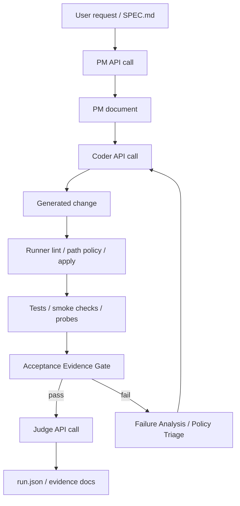

## 概要

`Local SDLC Agent` というリポジトリを公開しました。

https://github.com/nob-git-dev/local-sdlc-agent

これは、ローカルLLMの OpenAI 互換APIを使って、仕様作成、実装、検証、失敗分析を進めるためのコーディングエージェント基盤です。

単にLLMへ「このコードを書いて」と依頼するのではなく、開発プロセスを以下のように分割して制御します。

- PM
- Coder
- Judge
- Failure Analysis
- Project Policy Triage

各ロールは別々の system prompt と別々の API call で実行されます。情報交換は会話履歴ではなく、保存された Markdown / JSON 文書を介して行います。

## 作った理由

LLMを使ったコード生成では、次の問題が頻繁に起きます。

- 仕様を暗黙に補完する
- テスト未実行でも「動く」と説明する
- Coderの自己評価がレビューにも伝染する
- 同じ失敗を繰り返す
- 生成したテスト自体が誤っているのに製品コードを直し続ける
- diffやsearch/replaceなどの出力形式が壊れる
- モデルごとのtemperatureやmax_tokens設定が散在する

Local SDLC Agent は、これらを「プロンプトだけ」で解決しようとしません。

LLMの外側に runner を置き、仕様、生成物、実行証拠、失敗分析、受け入れ条件を機械的に扱います。

## アーキテクチャ

基本構造は次の通りです。



ポイントは、LLM同士を同じ会話履歴でつながないことです。

前段の結果は `.sdlc-runner/runs/` に保存され、後段のLLM callはその文書だけを根拠に判断します。

## 主要コンポーネント

リポジトリの中心は以下です。

```text
local_sdlc.py          # CLI entrypoint
local_sdlc/            # 実装本体
tests/                 # agent harness の回帰テスト
SPEC.md                # Local SDLC Agent 自体の仕様
sdlc-skills/           # SDLC prompt / skill assets
learning-skills/       # 学習・改善 prompt / skill assets
benchmarks/            # Tetris, Mini SQLite, Redis風KVS など
docs/                  # 設計判断、失敗分析、解説資料
```

内部は大きく次の責務に分けています。

| 領域 | 役割 |
|---|---|
| CLI / Presentation | コマンド入口、設定表示 |
| LLM client | OpenAI互換API呼び出し、streaming、model profile |
| Skill loader | SKILL.mdをsystem promptとして読み込む |
| Agent runner | PM / Coder / Judge / Failure Analysis の実行制御 |
| Artifact control | 生成物の抽出、正規化、lint、適用制御 |
| Verification | command実行、smoke test、実行証拠化 |
| Run state | `.sdlc-runner/runs/` への文書保存 |

## 生成物とは

このリポジトリでは、LLMがrunnerへ渡す適用候補を「生成物」と呼んでいます。

たとえば次のようなものです。

- unified diff
- `BEGIN_FILE`
- `BEGIN_SEARCH_REPLACE`
- JSONの `replace_file` / `search_replace`

LLMが生成物を出しても、それをそのまま適用しません。

runner が以下を検査します。

- 出力形式が成立しているか
- 対象パスが許可されているか
- conflict marker が混入していないか
- 期待する文脈に一致しているか
- テストまたはsmoke checkが通るか
- 仕様の受け入れ条件を満たした証拠があるか

この設計により、LLMは「提案する」が、最終的に適用・承認するのはrunnerという分離になります。

## ロール分離

Local SDLC Agent では、ロールを system prompt レベルで分けます。

```text
PM:
  仕様、制約、受け入れ条件、作業計画を整理する

Coder:
  許可された文書とファイル文脈だけから生成物を作る

Judge:
  Coderの自己申告ではなく、仕様と実行証拠から評価する

Failure Analysis:
  同じ失敗が続いたときに、観測事実、棄却仮説、次の必須行動を構造化する

Project Policy Triage:
  テスト所有権や修正対象の判断など、プロジェクト依存の境界問題を分類する
```

これらは単なるプロンプト上の見出しではなく、別々のAPI callとして実行されます。

## API設定は role ではなく function でも分ける

PM / Coder / Judge のようなロール分離だけでは不十分でした。

同じ Coder でも、新規生成、意味修復、形式修復、root-cause修復では必要な設定が異なります。

そこで、API設定は以下のように合成します。

```text
effective_profile =
  model_profile default
  -> global override
  -> role override
  -> function profile
  -> explicit function override
```

例:

```bash
python3 local_sdlc.py agent \
  "tetris.htmlを仕様に合わせて修正" \
  --include tetris.html \
  --apply \
  --model-profile qwen-agent \
  --api-profile generate_artifact:max_tokens=32768,temperature=0.05,thinking=off \
  --api-profile repair_artifact:max_tokens=8192,temperature=0,thinking=off
```

これにより、モデル差し替えや mixed-model 実験を後から追跡しやすくなります。

## 実行ログ

実行結果は `.sdlc-runner/runs/` に残ります。

代表的なファイルは次の通りです。

```text
01-pm-control.md
02-r01-coder-output.md
03-r01-*.md
04-r01-apply.md
05-r01-command-01.md
05-r01-failure-analysis.json
06-r01-judge-review.md
run.json
```

`run.json` には、API call数、最終判定、model profile、function別設定、証拠、失敗履歴などが保存されます。

## 受け入れ条件と実行証拠

Local SDLC Agent では、テストが通っただけでは完了扱いにしません。

`SPEC.md` の受け入れ条件と実行証拠を照合します。

概念的には次のように扱います。

```text
R = requirement propositions
E = executable evidence
C = coverage relation

C(E_i, R_j) -> pass | fail | unverified
```

`unverified` が残る場合、LLMが「完了した」と言っても承認しません。

## ベンチマーク

公開リポジトリには、以下のような例を含めています。

- Tetris
- Mini SQLite
- Redis風KVS

特に Mini SQLite は、段階分割、生成テストの誤り、出力形式崩れ、同一失敗の反復など、agent harness の改善材料として使いました。

## クイックスタート

Python標準ライブラリのみで動きます。

```bash
git clone https://github.com/nob-git-dev/local-sdlc-agent.git
cd local-sdlc-agent

python3 local_sdlc.py doctor --skip-llm
python3 local_sdlc.py list-skills
```

ローカルLLM APIが起動している場合:

```bash
python3 local_sdlc.py health
python3 local_sdlc.py doctor
```

デフォルトの接続先は次です。

```text
http://localhost:30000/v1
```

別URLを使う場合:

```bash
python3 local_sdlc.py health --base-url http://localhost:30000/v1
```

## 注意点

現時点では research preview です。

本番利用する場合は、少なくとも以下が必要です。

- 利用するLLMの挙動評価
- プロジェクト固有の安全ポリシー
- 生成物適用前のレビュー
- command実行範囲の制限
- CIでの回帰テスト
- 秘密情報をpromptやrun_dirへ混入させない設計

## ライセンス

このリポジトリは OSI 承認のオープンソースではありません。

位置づけは source-available research preview です。

- 非商用利用: 公開ライセンスの範囲で無料
- 商用利用: 別途商用ライセンスが必要
- 本番保証: なし

詳細はリポジトリ内の `LICENSE`、`COMMERCIAL-LICENSE.md`、`NOTICE.md` を参照してください。

## まとめ

Local SDLC Agent は、ローカルLLMを使ったコード生成を、仕様、文書、実行証拠、ロール分離、失敗分析で制御するための実験的な基盤です。

モデルの性能だけに依存せず、外側のプロセスで完遂性と安全性を上げることを目的にしています。

AI coding agent を実運用に近づけるには、プロンプトだけでは足りません。仕様、権限、検証、証拠、失敗履歴を扱う harness が必要です。

その一つの実装例として公開しています。
